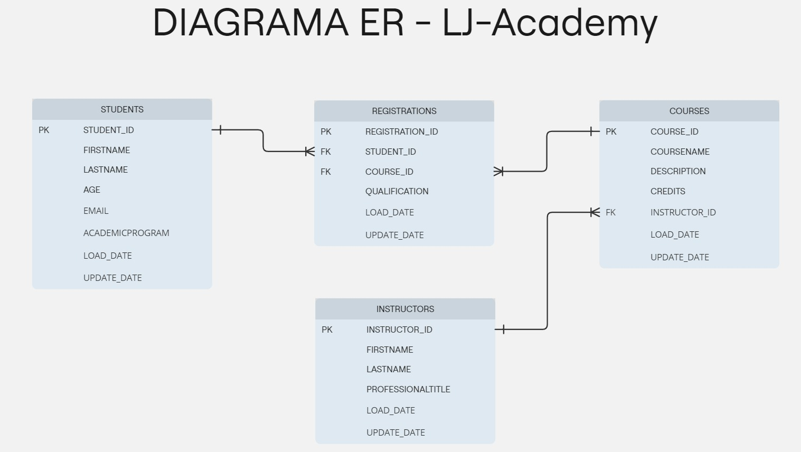

## :rocket: Introducción - Mis primeros pasos con SQL

El **objetivo** principal de nuestro proyecto es almacenar y gestionar la información relacionada con los estudiantes, los cursos e instructores de una academia de educación superior, creando así una base de datos pequeña y simple con el fin de practicar y afianzar los conocimientos aprendidos sobre SQL.

Para comenzar ejercitandonos en el manejo de las bases de datos, nada mejor que usar un sistema de gestión de base de datos relacional de código abierto, ligero, rápido, ideal para proyectos pequeños y medianos, que maneje un lenguaje SQL básico y además que sea flexible y no requiera instalación, como lo es: SQLite.

## :gear: Tecnologías utilizadas

Dentro de las tecnologías utilizadas, tenemos:

- **SQLite:** Sistema de gestión de base de datos (SGBD)
- **DB Browser for SQLite:** Aplicación de escritorio amigable con el usuario, diseñada para interactuar con SQLite. 
  [Sitio web oficial](https://sqlitebrowser.org/)
- **Miro:** Plataforma de desarrollo de flujo de trabajo y colaboración, que permite a los equipos crear diagramas, mapas mentales, tableros, etc. [Página web](https://miro.com/es/signup/)

## :books: Estructura de la base de datos

Contar con una estructura sólida en una base de datos es fundamental para garantizar su eficiencia, consistencia, flexibilidad y mantenibilidad. 

Para lograr esto, necesitamos empezar por realizar los planos arquitectónicos que nos permitan organizar las ideas, visualizar de forma clara la estructura de un sistema, comunicar el diseño e identificar posibles inconsistencias o redundancias.

Esos planos arquitectonicos definidos en nuestra área es lo que se conoce como esquema o diagrama entidad-relación (DER), es allí donde se muestran las entidades clave, las relaciones entre ellas y sus atributos. En nuestro caso especifico usamos la aplicación "Miro" para diseñar tal diagrama y presentarlo a continuación:

En el siguiente enlace se presenta una descripción detallada de la estructura de datos: 
[Descripción de la estructura de BD LJ-Academy](https://github.com/Johanna-Rojas/Creando_BD_SQLite/blob/main/Data-Structure/Documentation.md)

## :mag_right: DDL, DML y consultas

Teniendo nuestro esquema definido y normalizado, pasamos a la creacion y modificación de tablas, para luego ir a la ejecución de consultas que nos permitan gestionar los datos de las entidades y extraer información valiosa.

---
### Lenguaje de definición de datos (DDL)
"Lenguaje usado para definir y modificar la estructura de la base de datos"

Mediante este lenguaje creamos o eliminamos la base de datos, creamos las tablas, índices y vistas y/o añadimos, eliminamos o modificamos columnas.

A continuación se presentará un apartado del Script comó ejemplo documentado:

~~~
-- Creando la base de datos LJ-Academy en SQLite

CREATE DATABASE LJ-Academy;

-- Creando la tabla/entidad STUDENTS con sus atributos

CREATE TABLE IF NOT EXISTS "STUDENTS" (          -- Se crea la nueva tabla en caso de que no exista previamente
	    "STUDENT_ID"	INTEGER,          -- Primer atributo o culumna de la tabla, cuyo tipo de dato es valores enteros
	    "FIRSTNAME"	TEXT,          -- Segundo atributo de tipo texto
	    "LASTNAME"	TEXT,
	    "AGE"	INTEGER,
	    "EMAIL"	TEXT,
	    "ACADEMICPROGRAM"	TEXT,
	    "LOAD_DATE"	TEXT DEFAULT CURRENT_TIMESTAMP,          -- Estable el valor de tiempo actual cuando se inserta un nuevo registro
	    "UPDATE_DATE"	TEXT DEFAULT CURRENT_TIMESTAMP,          -- Estable el valor de tiempo actual cuando se inserta o actualiza un nuevo registro
	    PRIMARY KEY("STUDENT_ID" AUTOINCREMENT)          -- Clave primaria autoincrementable, se asignan valores únicos por registro
);

-- Creando la tabla/entidad REGISTRATIONS

CREATE TABLE IF NOT EXISTS "REGISTRATIONS" (
	    "REGISTRATION_ID"	INTEGER,
	    "STUDENT_ID"	INTEGER,
	    "COURSE_ID"	INTEGER,
	    "QUALIFICATION"	REAL,          -- Atributo de tipo decimal
	    "LOAD_DATE"	TEXT DEFAULT CURRENT_TIMESTAMP,
	    "UPDATE_DATE"	TEXT DEFAULT CURRENT_TIMESTAMP,
	    PRIMARY KEY("REGISTRATION_ID" AUTOINCREMENT),
	    FOREIGN KEY("COURSE_ID") REFERENCES "COURSES"("COURSE_ID"),          -- Clave foránea de COURSE_ID a clave primaria de la entidad COURSES
	    FOREIGN KEY("STUDENT_ID") REFERENCES "STUDENTS"("STUDENT_ID")
);
  ~~~

Para visualizar el Script completo de la estructura de datos, ir al siguiente enlace: [Esquema estructura de datos SQLite](https://github.com/Johanna-Rojas/Creando_BD_SQLite/blob/main/Esquema.sql)

---
### Lenguaje de manipulación de datos (DML)

---
### Consultas básicas

## :bookmark_tabs: Tablas
## :computer: Contribuciones