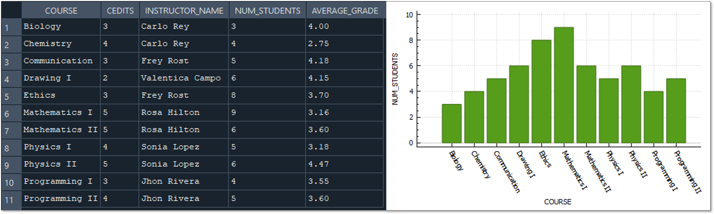

## :rocket: Introducción - Mis primeros pasos con SQL

El **objetivo** principal de este proyecto es almacenar y gestionar la información relacionada con los estudiantes, los cursos e instructores de una academia de educación superior, creando así una base de datos pequeña y simple con el fin de practicar y afianzar los conocimientos aprendidos sobre SQL.

Para comenzar ejercitandonos en el manejo de las bases de datos, nada mejor que usar un sistema de gestión de base de datos relacional de código abierto, ligero, rápido, ideal para proyectos pequeños y medianos, que maneje un lenguaje SQL básico y además que sea flexible y no requiera instalación, estas caracteristicas las tiene: SQLite.

## :gear: Tecnologías utilizadas

Dentro de las tecnologías utilizadas, tenemos:

- **SQLite:** Sistema de gestión de base de datos (SGBD)
- **DB Browser for SQLite:** Aplicación de escritorio amigable con el usuario, diseñada para interactuar con SQLite. 
  [Sitio web oficial](https://sqlitebrowser.org/)
- **Miro:** Plataforma de desarrollo de flujo de trabajo y colaboración, que permite a los equipos crear mapas mentales, tableros, diagramas como el Entidad - Relación, etc. [Página web](https://miro.com/es/signup/)

## :books: Estructura de la base de datos

Contar con una estructura sólida en una base de datos es fundamental para garantizar su eficiencia, consistencia, flexibilidad y mantenibilidad. 

Para lograr esto, necesitamos empezar por realizar los planos arquitectónicos que nos permitan organizar las ideas, visualizar de forma clara la estructura de un sistema, comunicar el diseño e identificar posibles inconsistencias o redundancias.

Esos planos arquitectonicos definidos en nuestra área, es lo que se conoce como esquema o diagrama entidad-relación (DER), es allí donde se muestran las entidades clave, las relaciones entre ellas y sus atributos. Para este proyecto se uso la aplicación "Miro" con el fin diseñar tal diagrama y presentarlo a continuación:

En el siguiente enlace se presenta una descripción detallada de la estructura de datos: 
[Descripción de la estructura de BD LJ-Academy](https://github.com/Johanna-Rojas/Creando_BD_SQLite/blob/main/Data-Structure/Documentation.md)

## :mag_right: Lenguaje de Definición y Manipulación de datos

Teniendo nuestro esquema definido y normalizado, pasamos a la creacion y modificación de tablas, para luego ir a la ejecución de consultas que nos permitan gestionar los datos de las entidades y extraer información valiosa.

---
### Lenguaje de definición de datos (DDL)
"Lenguaje usado para definir y modificar la estructura de la base de datos"

Mediante este lenguaje se pueden crear o eliminar bases de datos, tablas, índices y vistas y/o añadir, eliminar o modificar columnas.

A continuación se presenta un apartado del Script del proyecto comó ejemplo:

~~~
----------------------------------------------------------------------------------------------------
-- CREACIÓN DE OBJETOS (Base de datos, tablas, indices y vistas) DDL
----------------------------------------------------------------------------------------------------

CREATE DATABASE LJ-Academy;

CREATE TABLE IF NOT EXISTS "REGISTRATIONS" (
	    "REGISTRATION_ID"	INTEGER,
	    "STUDENT_ID"	INTEGER,
	    "COURSE_ID"	INTEGER,
	    "QUALIFICATION"	REAL,          -- Atributo de tipo decimal
	    "LOAD_DATE"	TEXT DEFAULT CURRENT_TIMESTAMP,
	    "UPDATE_DATE"	TEXT DEFAULT CURRENT_TIMESTAMP,
	    PRIMARY KEY("REGISTRATION_ID" AUTOINCREMENT),
	    FOREIGN KEY("COURSE_ID") REFERENCES "COURSES"("COURSE_ID"),          
	    FOREIGN KEY("STUDENT_ID") REFERENCES "STUDENTS"("STUDENT_ID")
);

CREATE INDEX idx_COURSENAME                          
ON COURSES(COURSENAME);

CREATE VIEW Students_Registered_Course AS              
SELECT s.FIRSTNAME, s.LASTNAME, s.ACADEMICPROGRAM, c.COURSENAME, c.ACADEMIC_CREDITS, r.QUALIFICATION      
FROM [STUDENTS]s                                       
INNER JOIN [REGISTRATIONS]r ON e.STUDENT_ID = r.STUDENT_ID coincidan los ID
INNER JOIN [COURSES]c ON r.COURSE_ID = c.COURSE_ID; 

DROP VIEW Students_Registered_Course

CREATE VIEW STUDENTS_COURSE AS              
SELECT s.FIRSTNAME, s.LASTNAME, s.ACADEMICPROGRAM, c.COURSENAME, c.ACADEMIC_CREDITS, r.QUALIFICATION      
FROM [STUDENTS]s                                      
INNER JOIN [REGISTRATIONS]r ON s.STUDENT_ID = r.STUDENT_ID 
INNER JOIN [COURSES]c ON r.COURSE_ID = c.COURSE_ID;

-----------------------------------------------------------------------------------------------------
-- MODIFICACIÓN DE OBJETOS (Modificar, renombrar, eliminar) DDL
----------------------------------------------------------------------------------------------------
ALTER TABLE COURSES                                     
RENAME COLUMN CREDITS TO ACADEMIC_CREDITS               

CREATE VIEW Students_Registered_Course AS     
SELECT s.FIRSTNAME, s.LASTNAME, s.ACADEMICPROGRAM, c.COURSENAME, c.ACADEMIC_CREDITS, r.QUALIFICATION    
FROM [STUDENTS]s     
INNER JOIN [REGISTRATIONS]r ON e.STUDENT_ID = r.STUDENT_ID     -- Error e.STUDENT_ID - Correción s.STUDENT_ID No existe la tabla con alias "e"  
INNER JOIN [COURSES]c ON r.COURSE_ID = c.COURSE_ID;     

DROP VIEW Students_Registered_Course;

  ~~~

Para visualizar el ***Script completo y documentado de la estructura de datos***, ir al siguiente enlace: [Esquema estructura de datos SQLite](https://github.com/Johanna-Rojas/Creando_BD_SQLite/blob/main/Data-Structure/Data_Structure.sql)

---
### Lenguaje de manipulación de datos (DML)
"Lenguaje usado para manipular los datos dentro de las tablas de la base de datos"

Este lenguaje permite consultar datos, recuperarlos, insertarlos, modificarlos, eliminarlos, etc.

Ejemplo del partado del Script del proyecto:

~~~
----------------------------------------------------------------------------------------------------
-- MANIPULACIÓN DE DATOS / DML
----------------------------------------------------------------------------------------------------
-- AGREGANDO DISPARADORES

CREATE TRIGGER BEFORE_UPDATE_INSTRUCTORS
BEFORE UPDATE ON INSTRUCTORS
BEGIN
	UPDATE INSTRUCTORS
	SET UPDATE_DATE = datetime('now')
	WHERE ROWID = NEW.ROWID;
END;

-- INSERTANDO NUEVOS REGISTROS 

INSERT INTO STUDENTS (FIRSTNAME, LASTNAME, AGE, EMAIL, ACADEMICPROGRAM)
	   VALUES ("Oliver","Jones",17,"oliverj@gmail.com","mechanical engineering"),
			  ("Jack","Valencia",21,"valenciajack@gmail.com","commercial engineering"),
			  ("Harry","Taylor",19,"harry2050@gmail.com","systems engineering");

-- ELIMINANDO REGISTROS 

DELETE FROM REGISTRATIONS
WHERE STUDENT_ID = 17;
DELETE FROM STUDENTS
WHERE STUDENT_ID = 17;

-- ACTUALIZANDO REGISTROS

-- Actualizaciones individuales
UPDATE REGISTRATIONS SET QUALIFICATION = 3.7 WHERE REGISTRATION_ID = 27;
UPDATE REGISTRATIONS SET QUALIFICATION = 2.9 WHERE REGISTRATION_ID = 28;

-- Actualización por lotes
UPDATE REGISTRATIONS                 
SET QUALIFICATION =                  
	(
		SELECT NEW_QUALIFICATION     
		FROM NEW_QUALIFICATIONS      
		WHERE REGISTRATIONS.REGISTRATION_ID = NEW_QUALIFICATIONS.REGISTRATION_ID     
	)     
WHERE QUALIFICATION IS NULL;

-- REALIZANDO CONSULTAS PARA EL ANALISIS 

-- Agrupando datos importantes de los cursos

SELECT sc.COURSENAME AS COURSE, sc.ACADEMIC_CREDITS AS CEDITS,
	   CONCAT(i.FIRSTNAME,' ',i.LASTNAME) AS INSTRUCTOR_NAME, 
	   COUNT(DISTINCT sc.FIRSTNAME) AS NUM_STUDENTS,
	   printf("%.2f", avg(sc.QUALIFICATION)) AS AVERAGE_GRADE
FROM STUDENTS_COURSE sc
INNER JOIN COURSES c ON sc.COURSENAME = c.COURSENAME 
INNER JOIN INSTRUCTORS i ON c.INSTRUCTOR_ID = i.INSTRUCTORS_ID
GROUP BY sc.COURSENAME

-- Identificando los estudiantes con la calificación más alta

SELECT CONCAT(s.FIRSTNAME,' ',s.LASTNAME) AS STUDENT_NAME, 
	   s.AGE,
       c.COURSENAME AS COURSE, 
	   s.ACADEMICPROGRAM,
	   MAX(r.QUALIFICATION) AS MAX_QUALIFICATION    
FROM REGISTRATIONS r
INNER JOIN STUDENTS s ON r.STUDENT_ID = s.STUDENT_ID
INNER JOIN COURSES c ON r.COURSE_ID = c.COURSE_ID
GROUP BY r.COURSE_ID
ORDER BY MAX_QUALIFICATION DESC, STUDENT_NAME

-- Calculando el promedio semestral

SELECT CONCAT(s.FIRSTNAME,' ',s.LASTNAME) AS STUDENT_NAME, 
	   s.AGE, s.ACADEMICPROGRAM,
	   COUNT(r.COURSE_ID) AS TOTAL_COURSES,
	   SUM(ACADEMIC_CREDITS) AS TOTAL_CREDITS,
	   printf("%.2f", SUM(r.QUALIFICATION * c.ACADEMIC_CREDITS) / SUM(ACADEMIC_CREDITS)) AS SEMESTER_AVERAGE
FROM STUDENTS s
INNER JOIN REGISTRATIONS r ON s.STUDENT_ID = r.STUDENT_ID
INNER JOIN COURSES c ON r.COURSE_ID = c.COURSE_ID
GROUP BY STUDENT_NAME
ORDER BY SEMESTER_AVERAGE DESC
~~~

Para visualizar el ***Script completo y documentado de Manipulación de datos***, ir al siguiente enlace: [Sentencias de manipulación de datos](https://github.com/Johanna-Rojas/Creando_BD_SQLite/blob/main/Data_Manipulation.sql)

## :bookmark_tabs: Tablas y Gráficos

De acuerdo a las sentencias de manipulacion y/o consulta de datos, se obtienen mediante el DB Browser for SQLite tablas y gráficos que pueden ser de interes para un análisis detallado de la información, en la siguiente carpeta [Tablas & Gráficos](https://github.com/Johanna-Rojas/Creando_BD_SQLite/tree/main/TablasGraficos) pueden encontrar la recopilación de algunos gráficos simples con sus respectivas tablas.

El siguiente gráfico de barras nos enseña el promedio de calificaciones obtenido por estudiante (suponiendo que corresponde a la nota semestral), de acuerdo a la cantidad de materias matriculadas y al total de creditos academicos:

*Nota: La herramienta no permite manipular los colores ni tipos de gráficos, por ende sería útil utilizar alguna otra herramienta para desarrollar los Dashboard.*

Del gráfico de barras podemos inferir por ejemplo que: 
- Dentro de los estudiantes con mejor promedio, Thomas Brown fue quien matriculo más asignaturas equivalentes a 16 créditos académicos y obtuvo 4.96 de una nota maxima de 5.0.
- Santiago Vega se registro a 2 cursos que suman 7 créditos y su promedio semestral fue el más bajo, de 1.93
- Harry Taylor fue quien se matriculó a más cursos (5) que equivalen a 17 créditos académicos (el máximo) y obtuvo un promedio de 3.43
- Olivia Martin estaba registrada a 2 de las asignaturas con los créditos más bajos, 6 en total y su promedio de calificaciones fue de 5.0

Con este segundo gráfico podemos concluir que:
- Al curso que más estudiantes se registraron fue al de Mathematics I (9 estudiantes)
- Al curso que menos estudiantes se registraron fue al de Biology
- El curso de Chemistry impartido por el instructor Carlo Rey tiene 4 estudiantes matriculados y es el que menor promedio de calificaciones tiene, de 2.75

*Nota: y así, podemos seguir jugando e infiriendo información valiosa de la base de datos [LJ-Academy](https://github.com/Johanna-Rojas/Creando_BD_SQLite/blob/main/LJ-Academy.db)*

## :computer: Contribuciones

Este proyecto genera un espacio para aprender y crecer. 
Siéntete libre de explorar el código, hacer preguntas y proponer mejoras. 
Tus comentarios son muy valiosos. :dizzy:

***¡Gracias por tu interés en el proyecto!***
